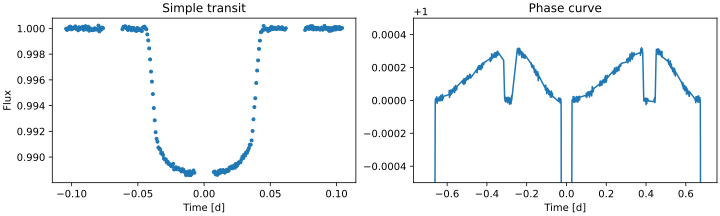

# Simple CHEOPS Light Curve Simulator

A simple Python package to simulate CHEOPS light curves for transits, eclipses, and phase curves. 

## Installation

Install from PyPI

    pip install cheopslcs

## Usage

    lcs = LCSim(window_width=24*1.5, exp_time=60, white_noise=1e-5)
    
    time, flux = lcs(radius_ratio=0.1, zero_epoch=0.0, period=0.7,
                     scaled_semi_major_axis=4.0, impact_parameter=0.1,
                     eccentricity=0.2, argument_of_periastron=0.23*pi,
                     geometric_albedo=0.5, limb_darkening=[0.2, 0.3],
                     efficiency=0.6, eff_phase=0.2)

## Contributing

Contributions are welcome! Feel free to open issues or submit pull requests to enhance the functionality or documentation.
License
